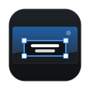
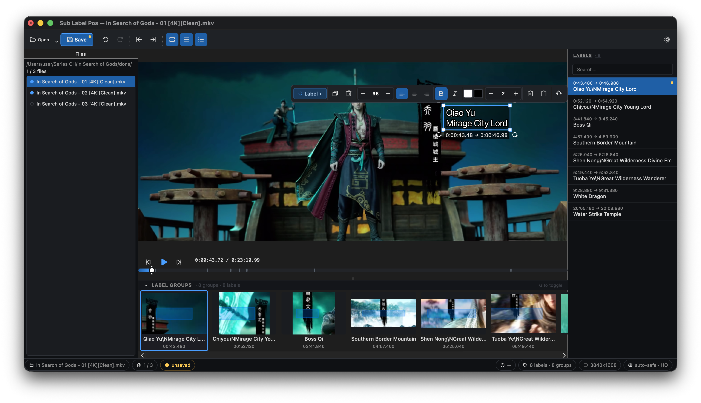
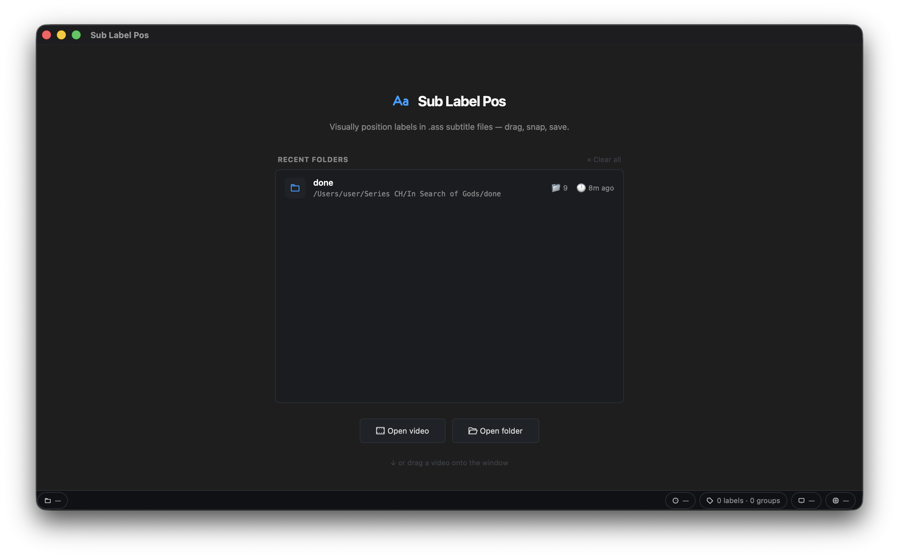
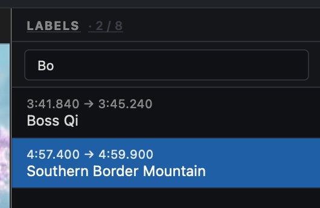
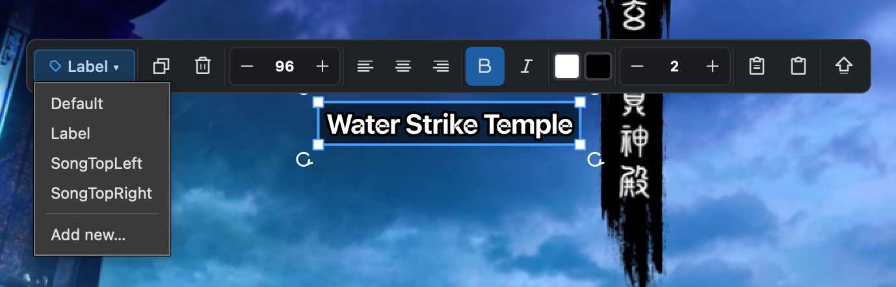
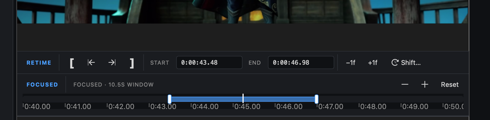
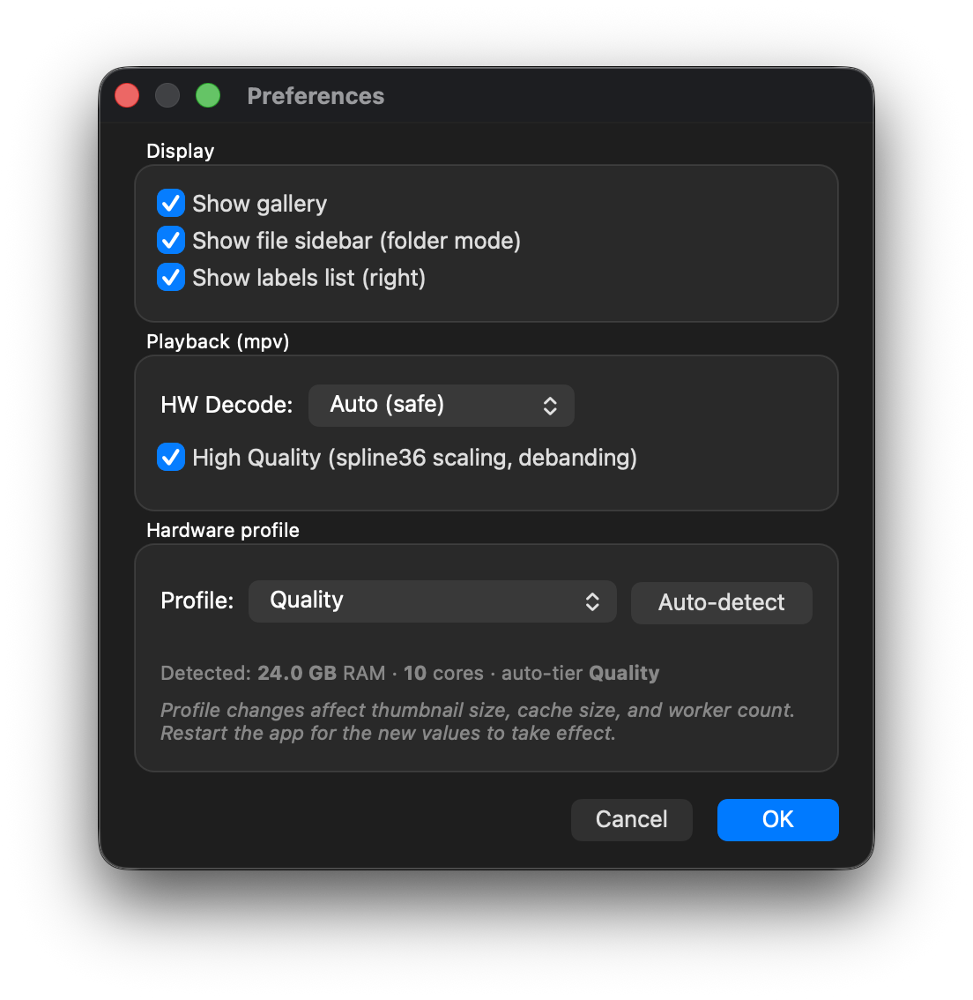

<p align="center"></p>

# Sign Manager

A desktop application for visually editing sign/label positions in ASS subtitle files. Load a video alongside its `.ass` file, then drag labels directly on the video frame to reposition them.

<p align="center">
  
</p>

## Features

- Drag-and-drop label repositioning on video frames
- Inline text editing (click a selected label to edit)
- Per-label font size, alignment, bold/italic, fill / outline color, outline width
- Duplicate, delete, and merge labels
- Copy/paste label styles between labels; promote inline overrides into the named style
- Frame-precise **label retiming** — Mark In / Mark Out at the current frame, absolute or relative numeric entry (`+250ms`, `-6f`, `+1.5s`), single-frame nudge, bulk shift, and direct-drag handles on a zoomed focused-timeline strip. Selection persists while scrubbing so out-of-window labels render as dimmed "ghosts" you can keep retiming.
- Right-side **labels list** with click-to-jump timestamps, live text search, and grouping for labels that share identical timing
- Optional thumbnail **gallery** of label groups for visual navigation (collapsible handle, toggle with `G`)
- Folder batch mode with background preloading for fast file switching, plus a left-side file sidebar with per-file ready/pending status
- Snap guides when aligning labels to each other
- Multi-select with Ctrl+click and group drag
- Persistent **status bar** with file index, frame timecode, label/group counts, resolution, and current HW-decode mode
- Settings dialog with three performance profiles (**Performance / Balanced / Quality**) that auto-detect on first launch and can be overridden at any time

## Download

Get the latest build from the [Releases page](https://github.com/blyat-uk/sign-manager/releases/latest):

| OS | File |
|---|---|
| Windows 10/11 (x64) | `sign-manager-vX.Y.Z-win.msi` (installer) or `-win.zip` (portable) |
| macOS 14+ (Apple Silicon) | `sign-manager-vX.Y.Z-mac.dmg` |
| Ubuntu 24.04+ / Debian 13 | `sign-manager-vX.Y.Z-linux-ubuntu.deb` — `sudo apt install ./sign-manager-*.deb` |
| Fedora | `sign-manager-vX.Y.Z-linux-fedora.rpm` — `sudo dnf install ./sign-manager-*.rpm` |
| Arch Linux | `sign-manager-vX.Y.Z-linux-arch.pkg.tar.zst` — `sudo pacman -U ./sign-manager-*.pkg.tar.zst` |

Verify downloads against `SHA256SUMS.txt` in the release.

- **Windows:** the installer is not code-signed; SmartScreen may ask you to confirm (More info → Run anyway).
- **macOS:** the app is not notarized. Open it once with right-click → Open, or run
  `xattr -dr com.apple.quarantine "/Applications/Sign Manager.app"`.
- **Fedora:** the stock `ffmpeg-free` cannot decode HEVC; install `ffmpeg` from [RPM Fusion](https://rpmfusion.org/) for H.265 video.

## First run

Sign Manager plays video with [mpv](https://mpv.io/) (libmpv) and reads frames with [FFmpeg](https://ffmpeg.org/). Neither is inside the download:

- **Windows and macOS:** on first start the app offers to download them once (about 126 MB on Windows, 27 MB on macOS) from this repository's [`runtime-deps-1`](https://github.com/blyat-uk/sign-manager/releases/tag/runtime-deps-1) release, checked against a pinned SHA-256. They are stored in your user data folder — `%LOCALAPPDATA%\sign-manager\runtime` on Windows, `~/Library/Application Support/sign-manager/runtime` on macOS — so app updates don't download them again. `sign-manager --install-runtime-deps` does the same from a terminal. If you'd rather install them yourself, choose **Manual instructions**; Homebrew's `brew install mpv ffmpeg` is picked up automatically on macOS.
- **Linux:** the packages depend on mpv and ffmpeg, so your package manager installs them.

Sign Manager was previously called **sub-label-pos**; your settings carry over automatically on first start.

Logs are written to `logs/sign-manager.log` in the same data folder (`~/.local/share/sign-manager` on Linux) when the app has no console. Set `SIGN_MANAGER_DATA_DIR` to use a different folder.

## Running from source

Requires Python 3.12+, plus libmpv and ffmpeg/ffprobe from your package manager (`sudo apt install libmpv2 ffmpeg`, `sudo dnf install mpv-libs ffmpeg`, `sudo pacman -S mpv ffmpeg`, `brew install mpv ffmpeg`; on Windows run `python -m sign_manager --install-runtime-deps` after installing).

```
git clone https://github.com/blyat-uk/sign-manager.git
cd sign-manager
uv sync --extra dev        # or: python -m venv .venv && pip install -e .[dev]
uv run sign-manager        # or: python -m sign_manager
uv run pytest
```

Command-line options: `--version`, `--self-test [--report FILE]` (checks every module and the external tools, exits 0/1), `--install-runtime-deps`, `--quit-after SECONDS`.

### Building the installers

Packages are built with [Briefcase](https://briefcase.readthedocs.io/) by `.github/workflows/release.yml` on every `v*` tag. Locally:

```
uv pip install briefcase
briefcase package macOS app -p dmg --adhoc-sign                         # on macOS
briefcase package windows app --adhoc-sign                              # on Windows
briefcase package linux system --target ubuntu:24.04 --adhoc-sign       # needs Docker; also fedora:44, archlinux:latest
```

The runtime-dependency zips are built by `.github/workflows/runtime-deps.yml` (scripts in `packaging/runtime_deps/`); the icon by `uv run --with pillow python packaging/make_icon.py`.

## Usage

### Opening files

<p align="center">
  
</p>

- Click the **Open** button in the toolbar (split-button menu: video file / folder / ASS only) to load a video. If a matching `.ass` file exists next to the video (same name, `.ass` extension), it loads automatically.
- Open a folder to load all videos in a directory — the left-side file sidebar appears with per-file ready/pending status while files preload in the background.
- Drag and drop a video file onto the window.
- The welcome screen lists your recent folders with file counts and last-opened time; click any row to reopen.

### Navigating labels

<p align="center">
  
</p>

- **Right sidebar (labels list)**: every label with its `start → end` timestamp. Click any row to jump the playback to that label's start time and select it on the canvas. Labels that share identical timestamps are grouped into a single row with a `×N` badge stacking all of their texts. The search box filters labels by text. Right-click a row for **Edit text**, **Jump to time**, or **Delete**.
- **Gallery** (bottom): thumbnail preview of label groups for visual navigation. Hidden by default on the Performance profile; toggle with the `G` shortcut or the toolbar button.
- **Timeline**: scrub or click the chunky playhead grip; group markers along the track jump to their group when clicked.

### Editing labels

<p align="center">
  
</p>

- **Click** a label on the canvas to select it. **Click again** to enter inline text editing.
- **Drag** a label to move it. Snap guides appear when aligning with other labels.
- **Ctrl+Click** to select multiple labels, then drag to move them together; a dashed bounding box and "N selected" badge show the group.
- **Right-click** a label for: edit text, duplicate, copy/paste style, sync times, merge (2-3 labels selected), delete.
- Use the **floating toolbar** that appears above a selected label for: style preset, font size, alignment, bold/italic, fill / outline color, outline width, copy/paste/promote style.

### Retiming labels

<p align="center">
  
</p>

Selecting a label reveals a floating **retime tray** at the bottom of the canvas (it overlays — the canvas and playback timeline never shift). Two sections stacked from top to bottom:

- **RETIME bar** — `[` (Mark In) and `]` (Mark Out) set the selected label's start or end to the current playhead frame. The two `←|` / `|→` buttons between them jump the player to the selected label's first or last frame so you can confirm the exact transition frame before pressing the bracket. The **Start** and **End** numeric fields accept absolute (`H:MM:SS.cc`, `M:SS.cc`, `SS.cc`) or relative (`+250ms`, `-6f`, `+1.5s`) input; press Enter to commit, Esc to revert. Frame nudge buttons `−1f` / `+1f` shift the entire selection by one frame preserving duration. **Shift…** opens a small popover for arbitrary deltas.
- **FOCUSED strip** — a zoomed-in mini-timeline auto-fit around the selection. Drag the white grip handles on the selected marker's edges to retime by direct manipulation — the strip auto-pans if you drag near its edge, and zoom-in stops at a 4 px/frame floor so every pixel of drag is a frame or finer. Mouse-wheel zooms (centered on cursor); `Zoom −` / `Zoom +` / `Reset` buttons in the header are also available. The main timeline below shows a blue viewport rectangle indicating where the focused strip is looking; drag the rectangle to pan the focused view.

The whole drag of a handle coalesces into one undo entry. Multi-select retiming works for all of the above: Mark In / Mark Out align every selected label's edge to the same point; nudge and shift apply the same delta to each label (preserving per-label durations). Relative numeric input on a multi-selection evaluates against each label's own current value.

When the playhead is outside a selected label's start/end window, the label still renders on the canvas at reduced opacity ("ghost"), so you can keep retiming it while seeking to where you want it to start or end.

### Saving

Press **Save** in the toolbar or use `Ctrl+S`. The Save button shows a yellow dot when there are unsaved changes; the status bar also surfaces an `unsaved` chip. The app warns about unsaved changes when switching files or closing.

### Settings (cog icon)

<p align="center">
  
</p>

- **Display**: toggle the gallery, file sidebar, or labels list.
- **Playback**: HW Decode mode (auto / VAAPI / NVDEC / software) and High Quality mpv scaling.
- **Hardware profile**: auto-detected on first launch (Performance / Balanced / Quality). Override manually at any time — affects thumbnail size, frame cache size, and worker counts. Most profile changes take effect on the next launch.

### Keyboard shortcuts

| Shortcut | Action |
|---|---|
| Left / Right arrow | Step one frame backward / forward |
| Space | Play / pause |
| Ctrl + Left / Right | Previous / next label group |
| Ctrl + Shift + Left / Right | Previous / next file (folder mode) |
| Ctrl + S | Save the ASS file |
| Ctrl + Z | Undo |
| Ctrl + Shift + Z / Ctrl + Y | Redo |
| Ctrl + D | Duplicate selected label |
| Ctrl + B / Ctrl + I | Toggle bold / italic on selected label |
| Ctrl + Shift + V | Paste style |
| Delete | Delete selected labels |
| I / O | Mark In / Mark Out (set selected label start / end to current frame) |
| Shift + Left / Right | Shift selected labels by −1 / +1 frame (preserves duration) |
| G | Toggle gallery |
| L | Toggle labels list (right sidebar) |

## How it works

The application extracts individual video frames using FFmpeg rather than playing the video. Labels from the ASS subtitle file are rendered as overlays on the video frame using Qt's painting system. When you reposition a label, the `\pos()` tag in the ASS file is updated in place. The font rendering applies a correction factor to match how libass (used by players like mpv) interprets font sizes, so label positions in this editor correspond accurately to what you see during playback.

The first time you launch the app it detects your machine's RAM and CPU and picks one of three performance profiles. Each profile sets sensible defaults for thumbnail extraction size, the editor frame cache, preload worker counts, and whether the gallery is shown by default. You can override the profile at any time from the Settings dialog.

## License

[MIT](LICENSE) © 2026 blyat-uk. The runtime-dependency downloads contain mpv and FFmpeg, which are GPL-licensed; see the `runtime-deps-1` release notes.
